# Introduction

## :trophy: A3.4 Learning activity

Project documentation using the Scrum framework for the planning and estimation phase.

---
  
## :pencil2: Development

1. Join your team and start preparing what is requested below:
   - [x] 1.1 Identify the tasks for each user story.
   - [x] 1.2 Estimate tasks using some digital tool.
   - [x] 1.3 Create the Sprint backlog with estimated tasks in hours.
   - [x] 1.4 Develop your gantt chart.
   - [x] 1.5 Identify dependencies of each task and relate it to the activity it depends on.
   - [x] 1.6 Develop the sprint Burndown chart.

   ##### :page_facing_up: [Web link to the documentation (Spring backlog, Gantt chart and Burndown chart)](https://e-smt.atlassian.net/l/c/50T1s1z2) or you can see the screenshots below :point_down: .
   
   ###### - Sprint backlog
   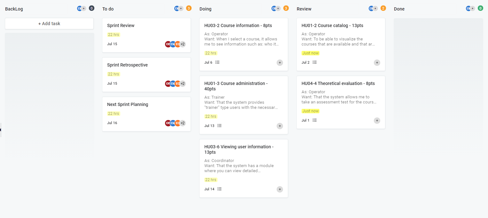
   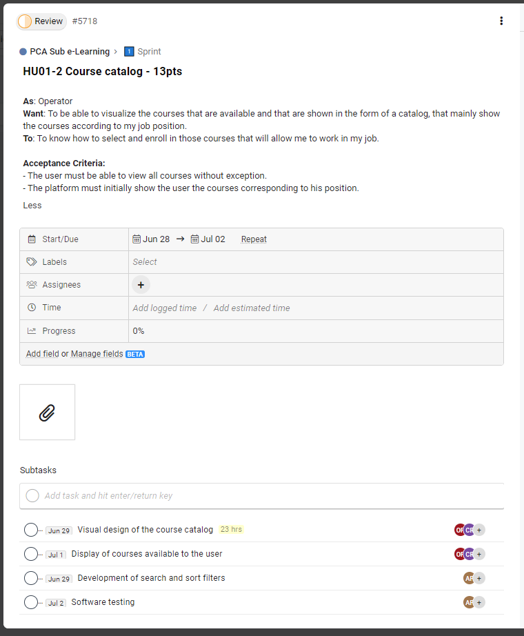
   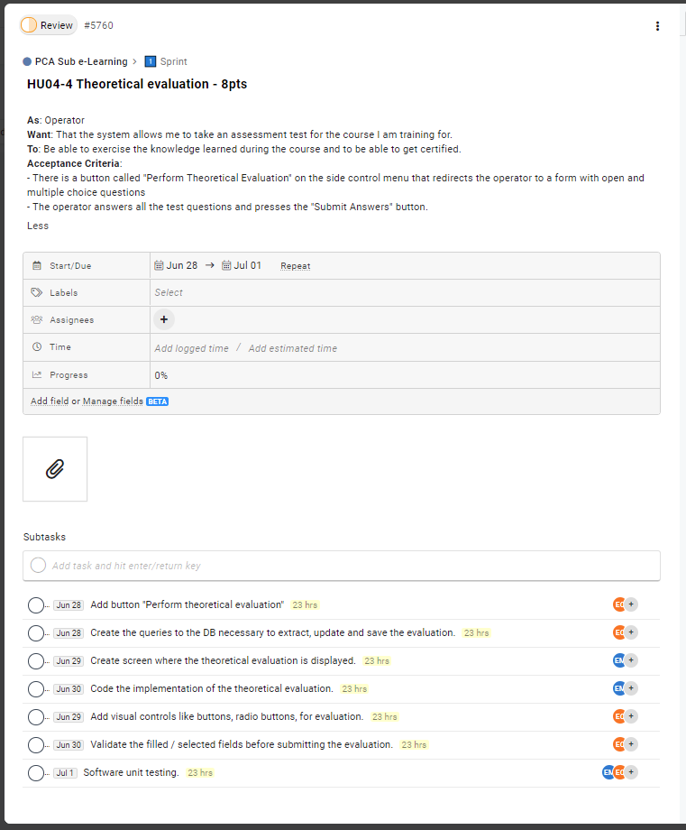
   
   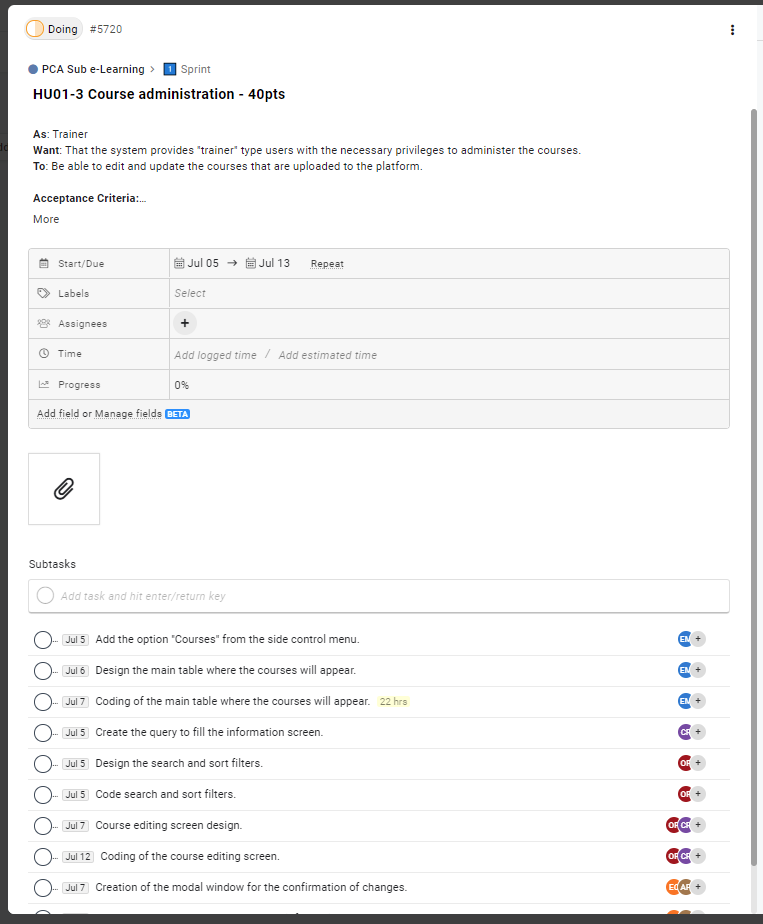
   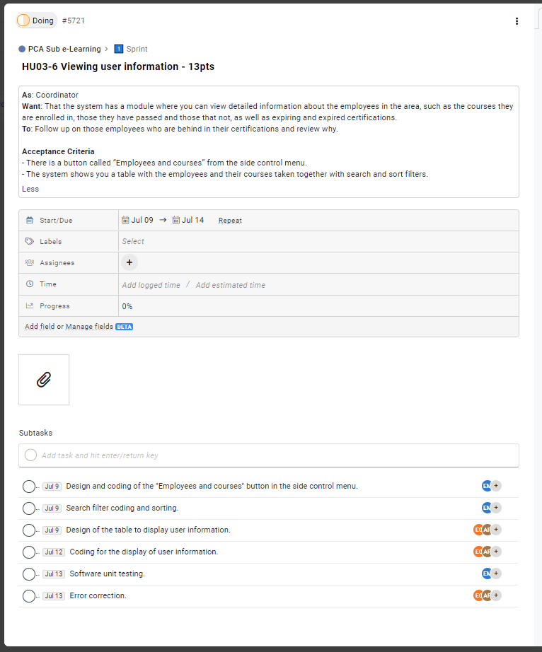
   ###### - Gantt chart
   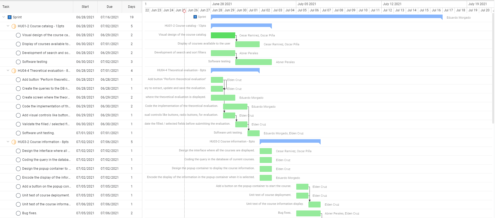
   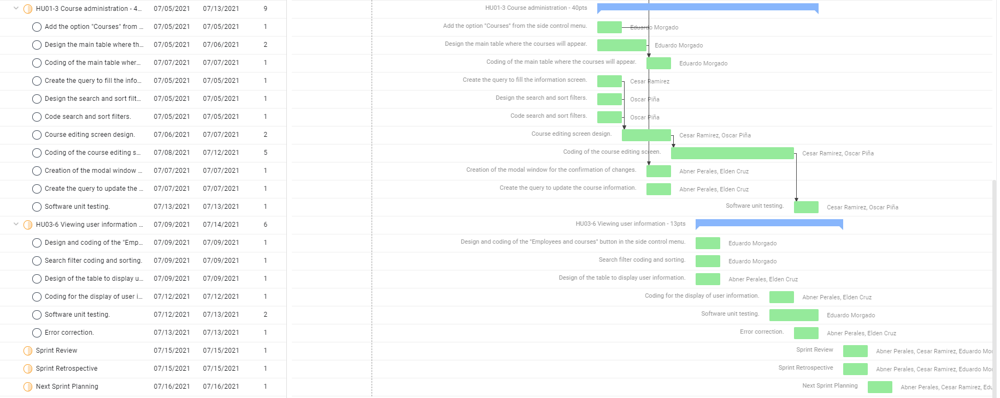
   ###### - Burndown chart
   
   
   

2. Present this information using visual and graphical tools within the sprint planning meeting.
3. Place a section with evidence that shows that you came together to develop the activity as a team.

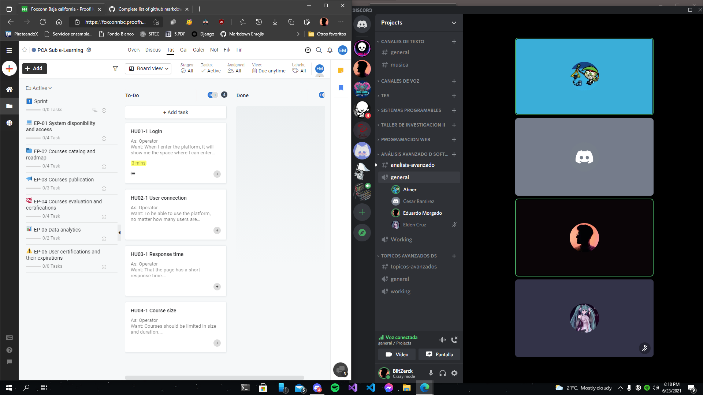
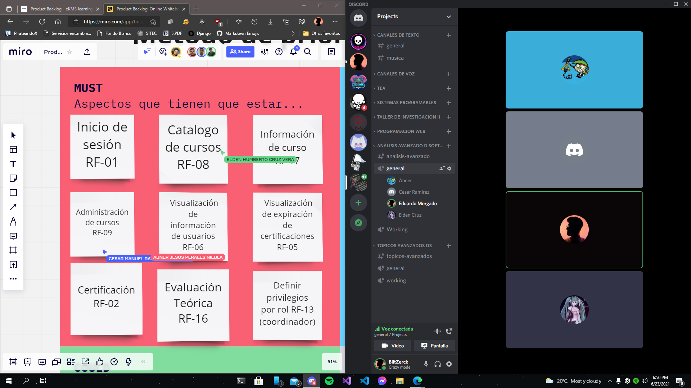
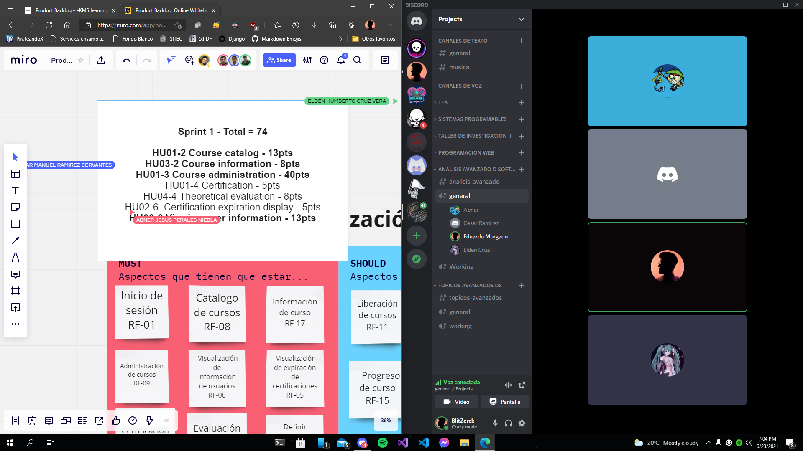

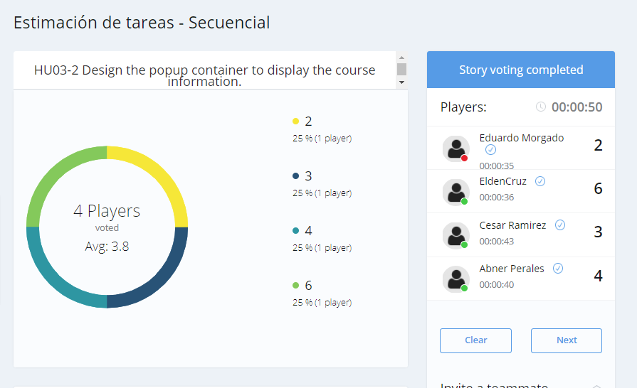
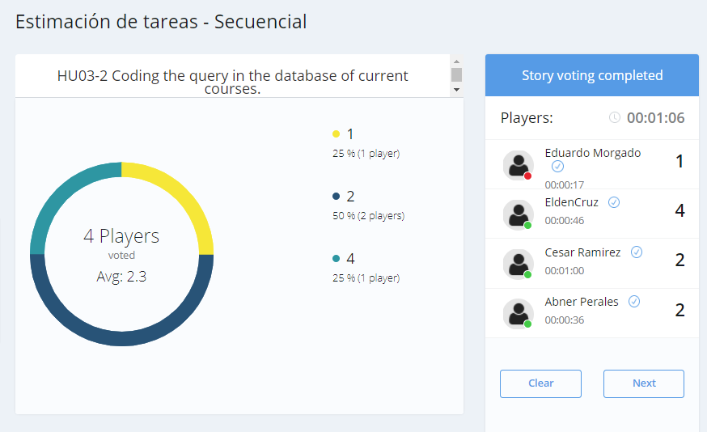
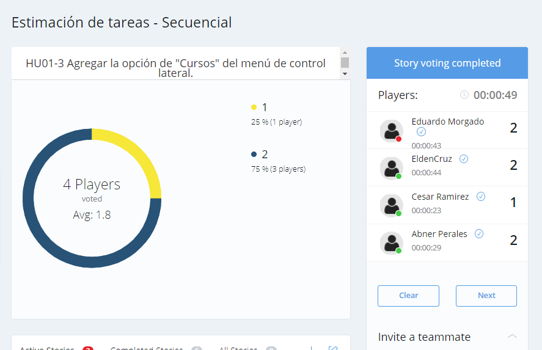
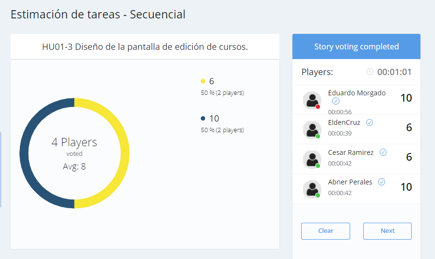
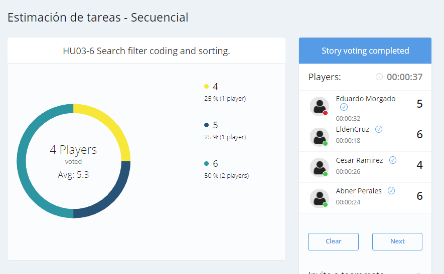
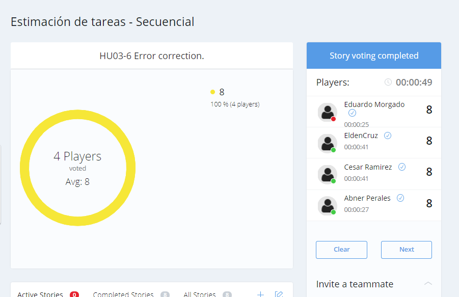

4. Include individual conclusions.

   - Cruz Vera Elden Humberto
    > As the previous activities we did, we had to hold a meeting for the correct development of this one, because we had to define the tasks for the user stories and estimate them. Obviously there were a couple of differences during the estimation of them since everyone has experience in programming, but we reached an agreement. In my opinion this whole process was quite complex and well I had never used a burndown chart before, but now I can appreciate why it is used. I feel that this is a good conclusion for everything related to the agile Scrum methodology, which we have been working on during this last unit.

    - Perales Niebla Abner Jesus
    > In this activity we did things that I had not done in projects with Agile Scrum, which is the time estimation of tasks. I liked this part because in this way, you can see more specifically the time you should invest in the development of the tasks. For example, at the beginning we had estimated the time of the tasks and the user stories, and even so, the Sprint seemed like a waterfall, some tasks after others. However, after thinking it over, we decided to overlap some tasks that can be done at the same time without any conflict. This benefits in not having a lot of downtime and that everyone is working on some task, which is completely efficient.

    - Piña Meza Oscar Andres
    > In this final activity we concluded with the development of the tasks and their estimates, in addition to developing a Burndown Chart which was interesting to observe it visually. With this activity we concluded working with the Scrum framework which I consider is very useful to manage tasks and a team, estimating the tasks was helpful to give us an idea of how the work would be but we could not carry it out to check that our estimates were not so incorrect, I personally consider that we would have lacked time but it would have been interesting to check it.

    - Ramirez Cervantes Cesar Manuel
    > This activity has been quite complicated for me to understand how to perform each of the tools that we use for the development of this activity, however I think that being in a team, the diversity of opinions among all helped us to find the best way to finish the activity. As it is the first time I use the gantt chart and the burn down chart, it was difficult for me to develop better in the activity, but thanks to my great team I solved most of my doubts.   Basically for this activity we estimate each one of the tasks that we are going to use for the development of our stories and in this way we epic them, using again the planitpoker tool to obtain the best estimates for these tasks.

    - Morgado Jacome Eduardo
    > In conclusion, both the realization of this activity and the one before last have been among my favorites, activities where as a team we must work together and share our different points of view to reach the same thinking about what, how and when the different activities to be developed for the project will be carried out. Specifically in this activity the most interesting was the estimation of tasks, where using a method proposed by the teacher (in this case sequential planning poker) we were able to determine how much time we estimate to invest in each task of the user stories, thus achieving to calculate the effort in hours to perform, which was represented in a burndown chart.   As a final conclusion, I can say that this subject seems important and indispensable in the grid of my career, because the teacher shows and exemplifies topics that are necessary for software development, where we realize that a computer systems engineer not only develop code, but documents, observes, defines and proposes solutions to solve problems.

___

### :bomb: Rubric

| Criteria     | Description                                                                                  | Score |
| ------------- | -------------------------------------------------------------------------------------------- | ------- |
| Instructions | Each of the points indicated within the instruction section are fulfilled?            | 10      |  | 5 |
| Development    | Each of the points requested within the development of the activity are answered?     | 60      |
| Demostration  | The student was present during the explanation of the functionality of the activity?            | 20      |
| Conclusions  | Does it include a personal opinion of the activity done by all of the team members? | 10      |

:house: [Go to home](../readme.md)

##### :open_file_folder: [Direct link to the repository on GitHub - Eduardo Morgado Jacome](https://github.com/EduardoMJ99/AnalisisAvanzadoSoft_2021-1) :open_file_folder:

##### :open_file_folder: [Direct link to the repository on GitHub - Abner Jesús Perales Niebla](https://github.com/AbnerPerales19/AnalisisAvanzadoDeSoftware_AbnerPerales) :open_file_folder:

##### :open_file_folder: [Direct link to the repository on GitHub - Elden Humberto Cruz Vera](https://github.com/CruzVeraEldenHumberto/Analisis-Avanzado-de-Software-Cruz-Vera) :open_file_folder:

##### :open_file_folder: [Direct link to the repository on GitHub - Oscar Andes Piña Meza](https://github.com/oscarpm96/Analisis-Avanzado-16210567.git) :open_file_folder:

##### :open_file_folder: [Direct link to the repository on GitHub - Cesar Manuel Ramírez Cervantes](https://github.com/CMRamirezC/Analisis_Avanzado-_Software_Ramirez_Cervantes.git) :open_file_folder: